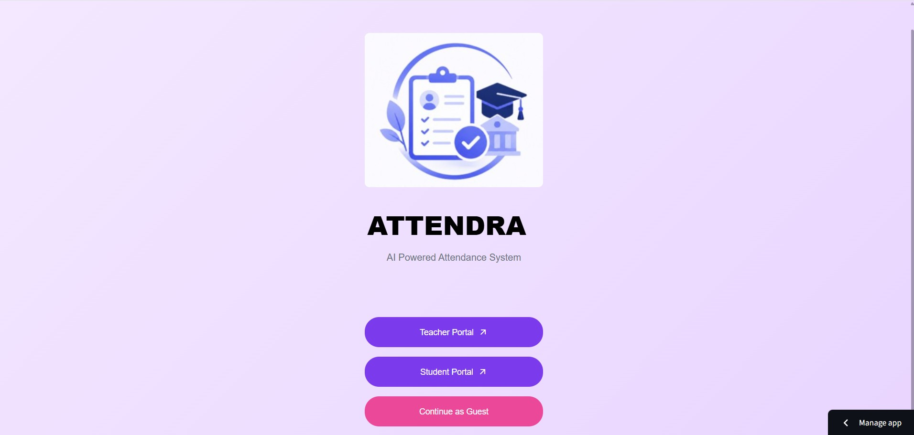
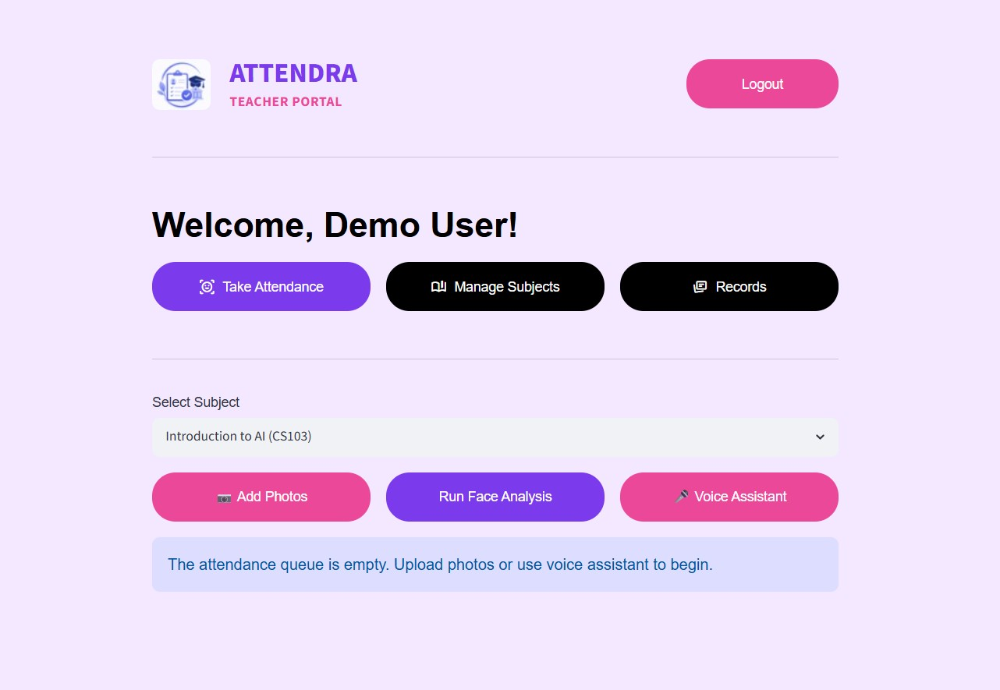
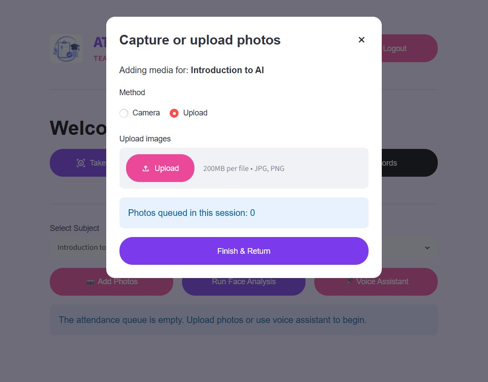
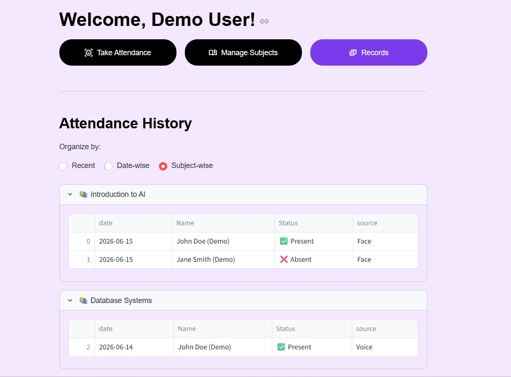
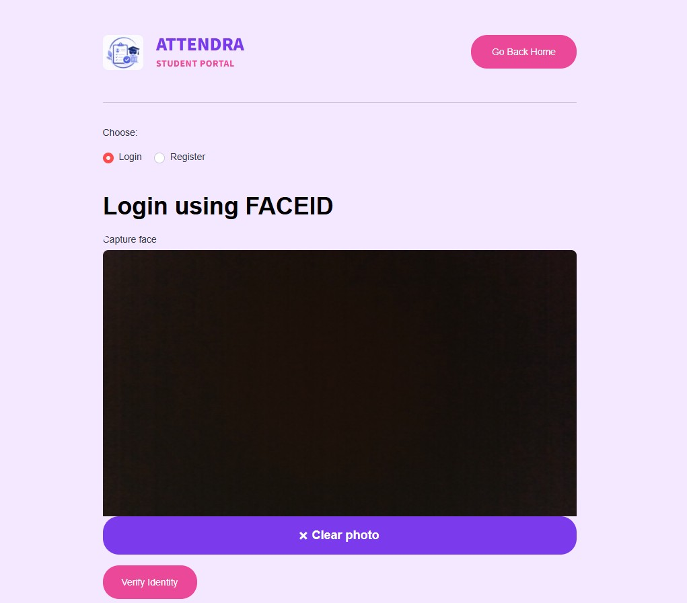
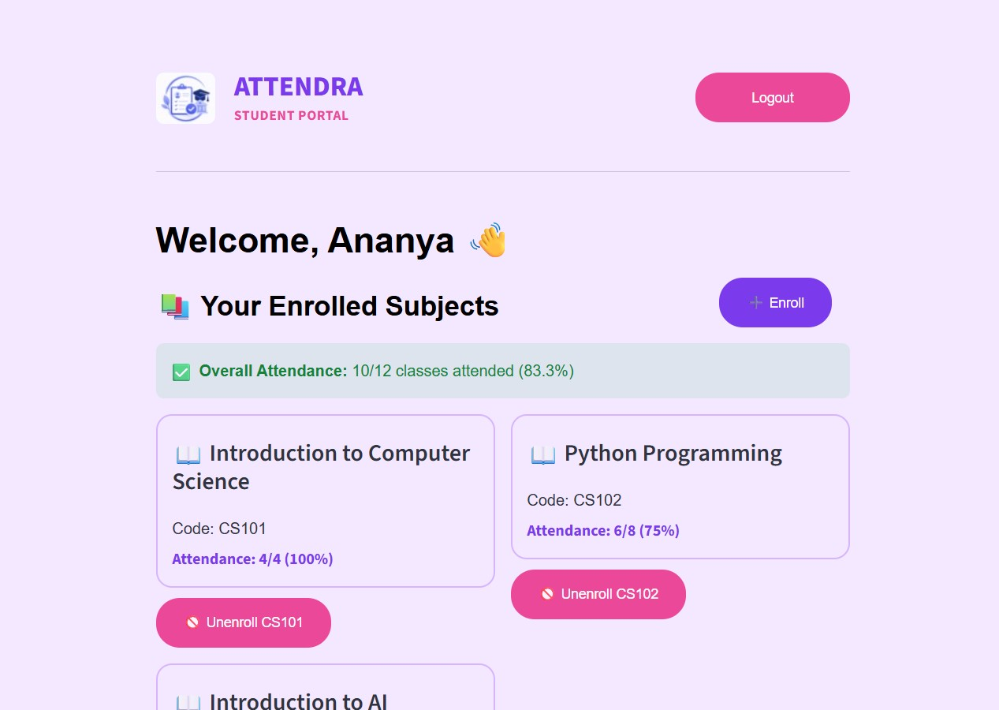
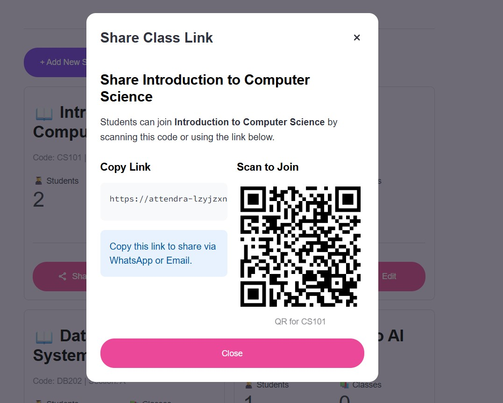
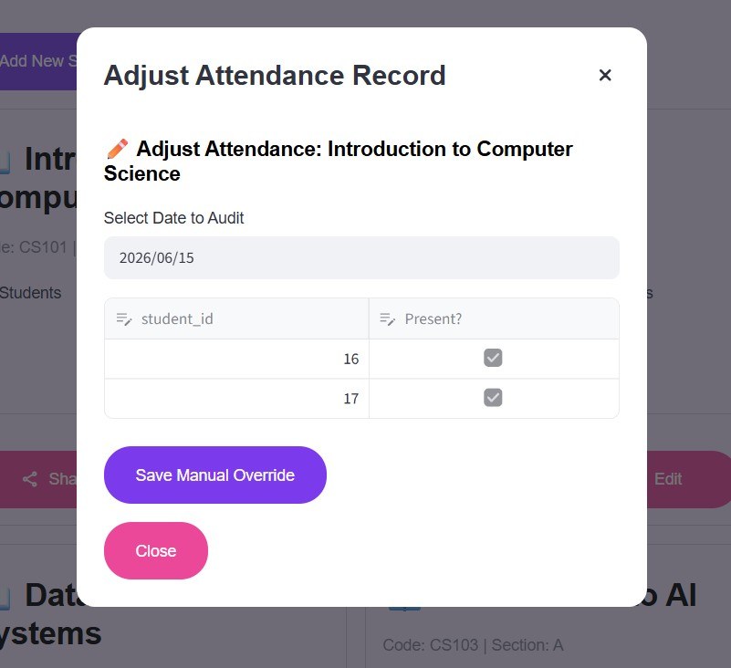

# ATTENDRA - AI Powered Attendance System

🔗 **Live Demo:** [https://attendra-lzyjzxnizakusascmehfz4.streamlit.app/]

📌 **Demo Access:** Click **Continue as Guest** on the home page to explore the Teacher Dashboard without creating an account.

---

## Overview

ATTENDRA is an AI-powered attendance management system that combines face recognition and voice verification to simplify classroom attendance.

The idea behind this project was to take machine learning out of notebooks and build a full working application around it.

The system includes:

* Teacher and Student portals
* Face-based authentication
* AI-assisted attendance marking
* Voice-assisted attendance
* Subject enrollment through QR codes, links, and course codes
* Attendance analytics and history
* Guest mode for demo access

---

## Features

### 👨‍🏫 Teacher Portal

* Register and login as teacher
* Create and manage subjects
* Take attendance using photos
* Voice-based attendance support
* View attendance records
* Share subjects using:
  * QR code
  * Direct link
  * Subject code
* Guest mode support

---

### 👨‍🎓 Student Portal

* Register using face data
* Login using face recognition
* Enroll in subjects
* View attendance percentage
* View attendance history
* Unenroll from subjects

---

## Attendance Workflow

### Face Attendance Pipeline

1. Teacher uploads classroom images
2. Faces are detected using InsightFace
3. 512-dimensional embeddings are generated
4. Embeddings are matched with student data
5. Matching students are marked present

---

### Voice Attendance Pipeline

1. Classroom audio is recorded.
2. Audio is segmented into speech regions.
3. Speaker embeddings are generated using Resemblyzer.
4. Similarity scores are computed against enrolled students.
5. Matched students are added to the attendance queue.

---

## Subject Enrollment

Students can join a subject using three methods:

### 1. QR Code
Teachers generate a QR code that opens the join page directly.

### 2. Direct Link
A link is shared that opens the app with the subject pre-filled.

### 3. Subject Code
Students can manually enter the course code to join.

---

## Demo Mode

The app includes a Guest Mode so anyone can try it without signing up.

Guest Mode includes:

* Sample subjects
* Fake attendance data
* Simulated face and voice results
* No database changes

---

## Tech Stack

### Frontend

* Streamlit

### Backend & Database

* Supabase
* PostgreSQL
* bcrypt

### Machine Learning & Computer Vision

* InsightFace
* ONNX Runtime
* Resemblyzer
* OpenCV
* NumPy
* Scikit-learn

### Data Processing

* Pandas
* Librosa

### Utilities

* Segno
* Pillow

---

## Project Structure

```text
ATTENDRA
│
├── app.py
├── requirements.txt
├── README.md
└── src
    ├── components
    ├── database
    ├── pipelines
    ├── screens
    └── ui
```

---

## Installation

Clone the repository:

```bash
git clone https://github.com/neemo13/attendra
cd ATTENDRA
```

Install dependencies:

```bash
pip install -r requirements.txt
```

Create:

```text
.streamlit/secrets.toml
```

Add:

```toml
supabase_url = "YOUR_SUPABASE_URL"
supabase_key = "YOUR_SUPABASE_KEY"
```

Run the application:

```bash
streamlit run app.py
```

---

## 📸 Screenshots

### Home Page


### Teacher Dashboard


### Face Attendance


### Attendance Records


### Student Dashboard


### Student Dashboard (Alt View)


### QR Enrollment


### Manual Enrollment


---

## What I Learned From Building This Project

This project taught me much more than training machine learning models.

### API and Database Handling

How to deal with real-world data, missing values, and API responses.

### Streamlit Behavior

How Streamlit reruns scripts and how to manage state using st.session_state.

### Separating Demo and Real Logic

Built a Guest Mode to safely show the app without touching real data.

### Working with Embeddings

Handled face and voice embeddings and stored them in a database.

### Building Full Applications

Combined ML, backend, frontend, and deployment into one system.

---

## Future Improvements

* Better voice enrollment and verification
* Attendance analytics dashboard
* Export reports (PDF/CSV)
* Timetable integration
* Email notifications
* Mobile-friendly UI

---

## Author

Built by **Ananya K**

Final Year B.Tech Student | AI / ML + Full Stack Developer
